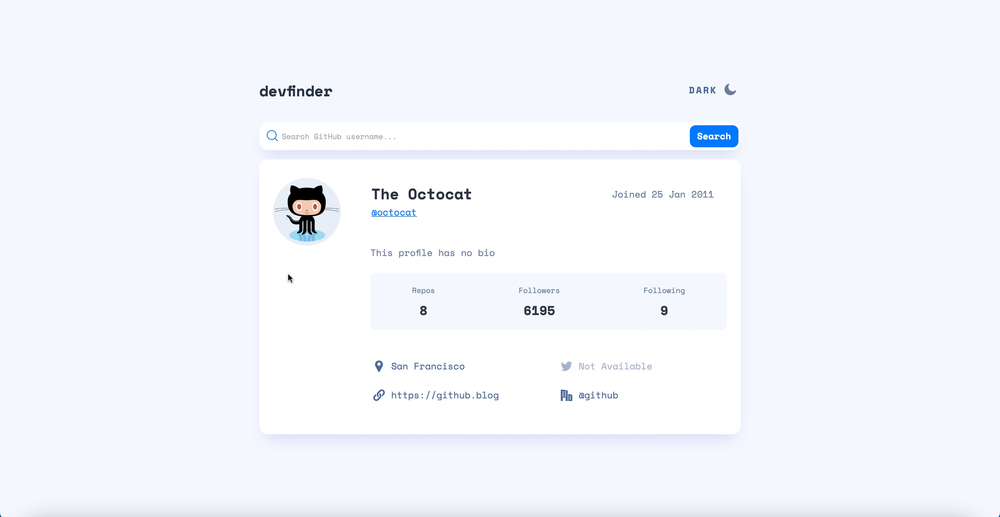

# Frontend Mentor - GitHub user search app solution

This is a solution to the [GitHub user search app challenge on Frontend Mentor](https://www.frontendmentor.io/challenges/github-user-search-app-Q09YOgaH6). Frontend Mentor challenges help you improve your coding skills by building realistic projects. 

## Table of contents

- [Overview](#overview)
  - [The challenge](#the-challenge)
  - [Screenshot](#screenshot)
  - [Links](#links)
- [My process](#my-process)
  - [Built with](#built-with)
  - [What I learned](#what-i-learned)
  - [Continued development](#continued-development)
  - [Useful resources](#useful-resources)
- [Author](#author)

## Overview

### The challenge

Users should be able to:

- View the optimal layout for the app depending on their device's screen size
- See hover states for all interactive elements on the page
- Search for GitHub users by their username
- See relevant user information based on their search
- Switch between light and dark themes
- **Bonus**: Have the correct color scheme chosen for them based on their computer preferences. _Hint_: Research `prefers-color-scheme` in CSS.

### Screenshot

### Links

- Solution URL: [https://github.com/CarvalhoVincent/GitHub-user-search-app]
- Live Site URL: [https://carvalhovincent.github.io/GitHub-user-search-app/]

## My process

### Built with

- Semantic HTML5 markup
- CSS custom properties
- Flexbox
- CSS Grid
- Mobile-first workflow
- Javascript
- Github API

### What I learned

I learned how to connect an API, and retrieve data from it. How to display a dark mode depends of user preference, how to change a date format using a library. Globally I improved my JavaScript skills, and also responsive layout with Grid and Flexbox properties. 
How to change color of svg.

### Continued development

Grid and Flexbox skills, responsive efficiency, JavaScript, refactoring code ?

### Useful resources

- [https://www.w3schools.com] - Used it for some reminders about CSS and JS.
- [https://stackoverflow.com/ ] - Used it for the date format, it helps me cause I was stuck at this point. I found how to use a library, to display the date correctly and look like the asked design.

## Author

- Frontend Mentor - [@CarvalhoVincent](https://www.frontendmentor.io/profile/CarvalhoVincent)

